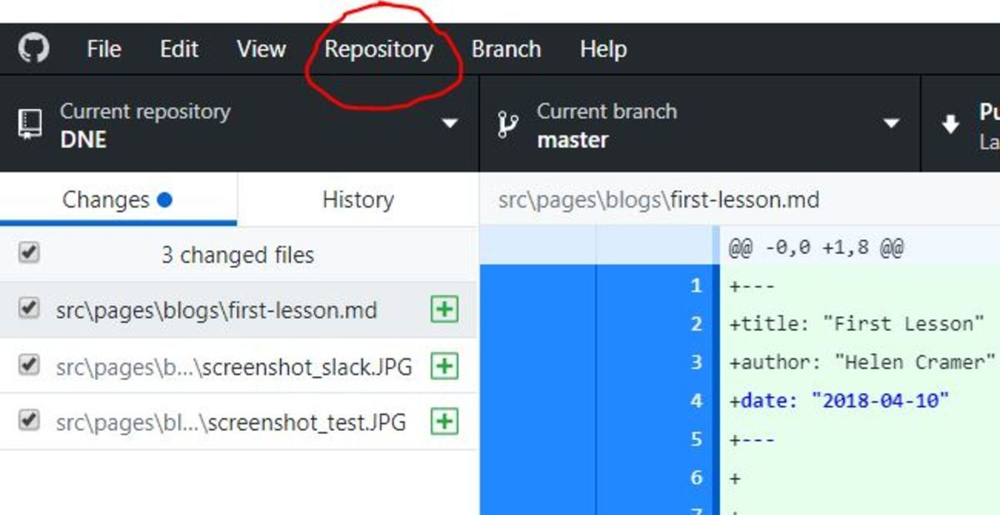

Hey guys,

I'm writing this blog to give us all a little summary of last lesson and to wrap
up all the steps you need to take to make changes at our dne Website. Sure, Dr.
Anders has given us a lot of information on slack and regularly updates the
Website, but I want to try to explain it in my own words. I hope it helps you to
get started :)

### So let's start with **Step 1**: Install the following programs

* Node LTS version 8: [https://nodejs.org/en/](https://nodejs.org/en/)
* Yarn (A Node Package Manager):
  [https://yarnpkg.com/lang/en/docs/install/](https://yarnpkg.com/lang/en/docs/install/)
* Version control: [https://git-scm.com/](https://git-scm.com/)
* Git Gui: [https://desktop.github.com/](https://desktop.github.com/). You will
  also need to create your own GitHub Account online on github.com
* Python Version 2.7:
  [https://www.python.org/downloads/](https://www.python.org/downloads/)
* Editor vscode:
  [https://code.visualstudio.com/](https://code.visualstudio.com/)
* I am on Windows, but I understood that you have to install xcode, if you are
  on Mac.

### **Step 2**: Create a local fork of the website

On
[https://github.com/DrUlrichAnders/dne](https://github.com/DrUlrichAnders/dne)
is the website repository. The repository contains all files needed to edit the
current website, or to copy and taylor it for your own use.

* Click the link. On the top right, click `Fork`. This will copy this project
  into your GitHub Account.

* Copy the first command `yarn global add gatsby-cli` and paste it into your
  command prompt (for windows search cmd. For mac I have no clue, sorry guys).

* Now, open your GitHub Desktop App and go to `file --> clone repository`.
  Select your forked project. Make sure to choose a file path so that you can
  find your files later. You just downloaded all files of the website!

* the 'dne'-Project is now in your GitHub Desktop App. Click on
  `Repository --> Open in Command Prompt`. Type in `yarn install` and hit enter.
  This will install a package needed to run the web server. Then do the same
  thing with `gatsby develop`. This command will start your web site on your
  computer. In order to preview the website that you are editing, go to
  [http://localhost:8000](http://localhost:8000).

### **Step 3**: Start editing

* Open vscode which you downloaded in **Step 1**.
* Click on Open File and select your downloaded GitHub Repo from **Step 2**. Now
  the folder structure of the website should be visible in your editor and you
  can start editing! Just navigate to the respective page and taylor the code :)
* Don't forget to save the changes with `Strg + S`.

### **Step 4**: Publish your changes to your fork

* Open your GitHub Desktop App. You will instantly see the changes you have made
  to the code (marked in red and green).
* On the bottom left, you can see a description box for documentation purposes.
  Name your changes and explain briefly what you did.
* Click `Commit to master` to save the current status of your website folders.
* Click on `push origin` at the top right.

### **Step 5**: Generate a Pull Request (PR) to the original repository

* Now, go to your GitHub fork of the original repository.
* GitHub offers you to generate a Pull Request from comparing your fork with the
  original repository.
* Confirm to generate PR.
* Done. Congrats.
